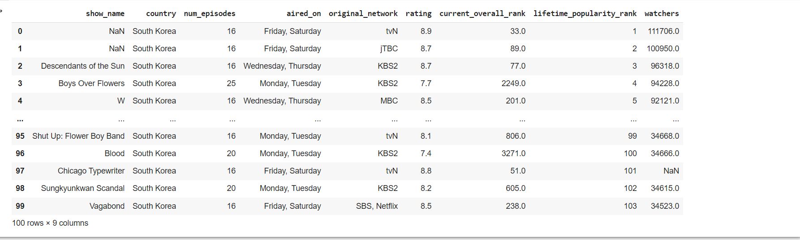
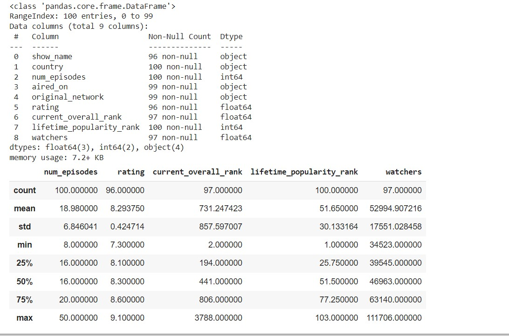
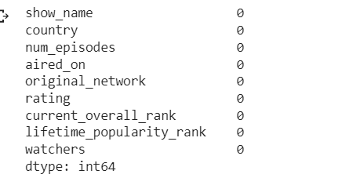
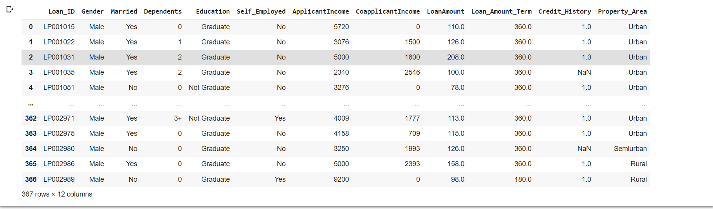
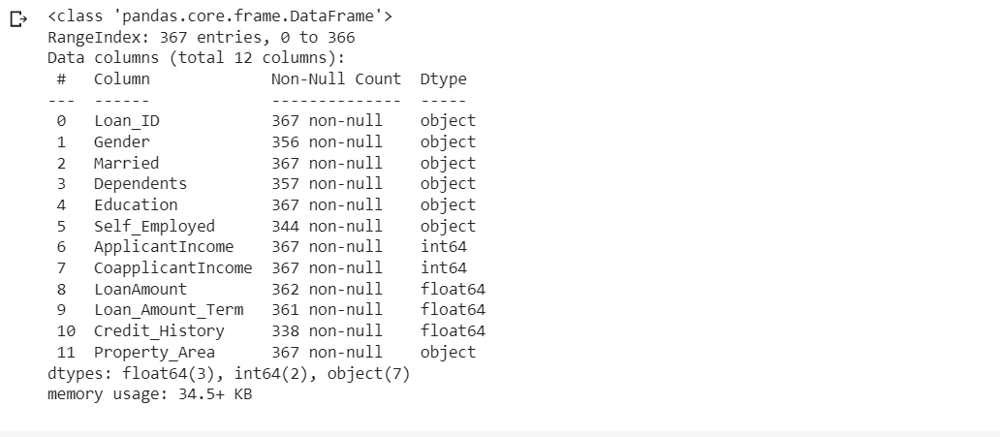
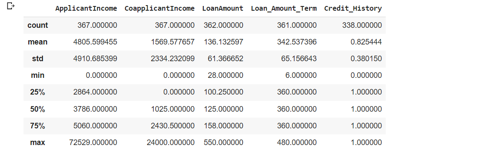
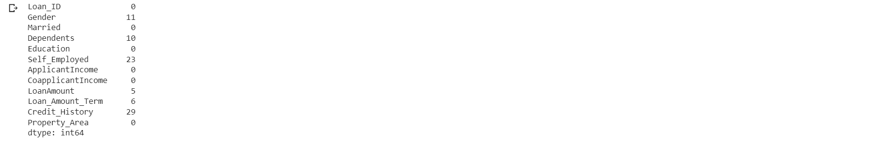
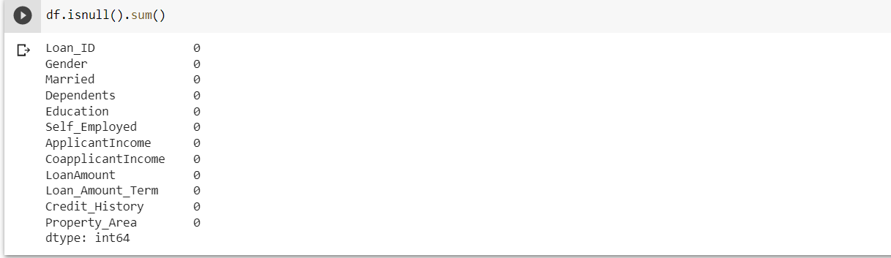

# Ex-01_DS_Data_Cleansing
# AIM
To read the given data and perform data cleaning and save the cleaned data to a file.

# Explanation
Data cleaning is the process of preparing data for analysis by removing or modifying data that is incorrect ,incompleted , irrelevant , duplicated or improperly formatted. Data cleaning is not simply about erasing data ,but rather finding a way to maximize datasets accuracy without necessarily deleting the information.

# ALGORITHM
## STEP 1
Read the given Data
## STEP 2
Get the information about the data
## STEP 3
Remove the null values from the data
## STEP 4
Save the Clean data to the file
# CODE
``` python
import pandas as pd
df=pd.read_csv("/content/Data_set (1).csv")
df

df.info()
df.describe()

df.duplicated().sum()

df.isnull().sum()
#Mode
df['show_name'] = df["show_name"].fillna(df['show_name'].mode()[0])
df['country']=df["country"].fillna(df['country'].mode()[0])
#Mean
df['num_episodes'] = df["num_episodes"].fillna(df['num_episodes'].mean())
#Median
df['rating'] = df["rating"].fillna(df['rating'].median())
df['current_overall_rank'] = df["current_overall_rank"].fillna(df['current_overall_rank'].median())
df['watchers'] = df["watchers"].fillna(df['watchers'].median())
#Mode
df['aired_on']=df["aired_on"].fillna(df['aired_on'].mode()[0])
#fillna
df['original_network']=df["original_network"].fillna(df['original_network'].mode()[0])
```
```python
import pandas as pd
df=pd.read_csv("/content/Loan_data (1).csv")
df

df.info()
df.describe()

df.duplicated().sum()

df['Gender'] = df['Gender'].fillna(df['Gender'].mode()[0])
df['Self_Employed'] = df['Self_Employed'].fillna(df['Self_Employed'].mode()[0])
df['Dependents'] = df['Dependents'].fillna(df['Dependents'].mode()[0])
#MEAN:
df['LoanAmount'] = df['LoanAmount'].fillna(df['LoanAmount'].median())
#VALUE METHOD:
df['Loan_Amount_Term'] = df['Loan_Amount_Term'].fillna(value=360.0)
#BACKWARD METHOD:
df['Credit_History'] = df['Credit_History'].fillna(method='bfill')
```
# OUTPUT







